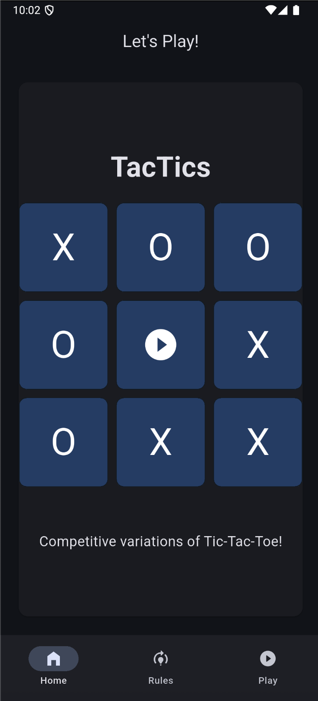
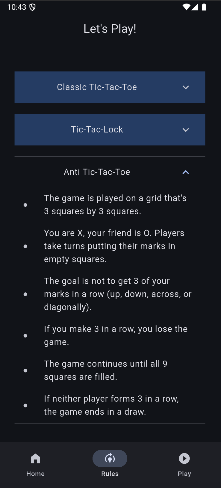
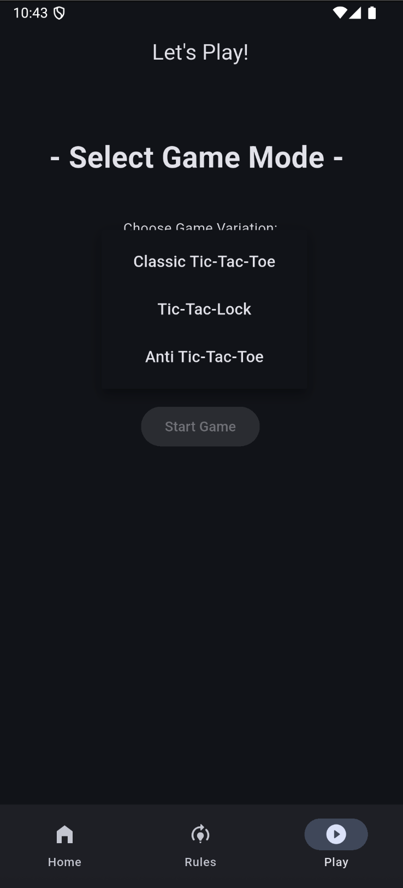
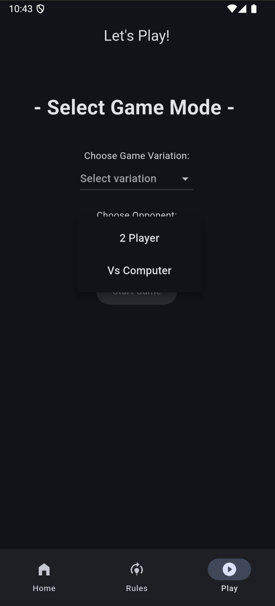
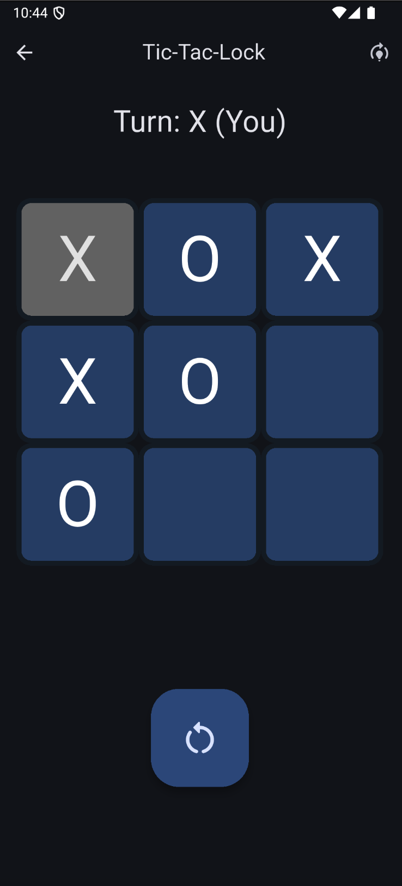

# TacTics  
A modern twist on Classical Tic-Tac-Toe with stacking mechanics. 

---
### Highlights:
- **Smart AI**: All game modes feature intelligent opponent behavior using the **Minimax algorithm** for adversarial search.
- **Two Modes**: Play against a friend or challenge the computer in single-player mode.
- **Multiple Game Types**: Explore different rulesets that add new layers of strategy and replayability.
- **Modern UI**: Redesigned homepage for smoother navigation and an intuitive user experience.
- **Tactical Gameplay**: Each mode requires unique approaches, testing both planning and adaptability.
- **Modular Design**: Easily extendable to add future game modes and enhancements.
- **Lightweight Build**: Quick installation and smooth performance on Android devices.

---

### Game Variations Developed:

> **Classic Tic-Tac-Toe**  
> Traditional gameplay where the first player to align 3 marks in a row (horizontally, vertically, or diagonally) wins.

> **Tic-Tac-Lock**  
> Each player can place only 3 marks on the board. When placing a fourth, the oldest mark is automatically locked and removed after the player's turn. This ensures that the game never has a draw.

> **Anti Tic-Tac**  
> A reverse challenge—forming 3 in a row means you **lose** the game.

---

### Development in progress:
**Gobblers Gobblet**  
A variant where each player has 3 differently sized pieces (small, medium, large).  
Larger pieces can **gobble** smaller ones, opening up layered strategy. The goal still remains the smae,i.e, align 3 in a row.

---

### Download and play the game:
- [Download APK](https://drive.google.com/drive/folders/1msKnhcO-XBbn1beACiwYg6lNOT84jC8Z?usp=sharing)
- Built exclusively for **Android** devices.
- Download the APK, allow permissions, and install it on your device.
- Once installed, you're ready to play!

---

### Screenshots of the app:

 

 

---